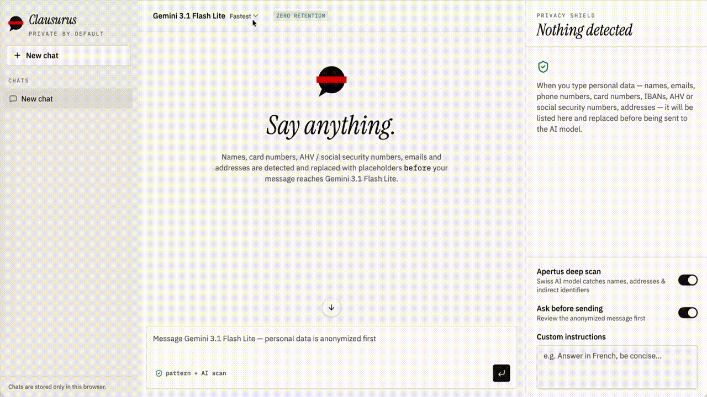
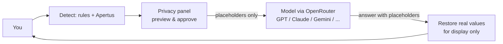

# Clausurus

**A privacy checkpoint for AI chat.** Clausurus is a chat interface that lets you talk to frontier
models (GPT, Claude, Gemini, and 300+ others via [OpenRouter](https://openrouter.ai)) while
Swiss detection rules and [Apertus](https://www.swiss-ai.org/apertus) — Switzerland's fully
open language model — replace personal data with placeholders *before* the prompt ever
leaves your browser for a foreign provider.

> Built at **Swiss {ai} Weeks 2026**.
> Status: hackathon prototype. Not production-ready and not a legal compliance guarantee.



---

## The problem

Public administrations, schools and regulated companies in Switzerland want the quality of
frontier models, but their daily work is full of personal data: names, addresses, AHV
numbers, IBANs, case details.

The rules are often strict. For example, the Canton of Zurich's guidance for its
administration says online AI generators are not an official work tool and that prompts
must not contain official personal data
([DSB Kanton Zürich](https://www.datenschutz.ch/tb/2023/online-ki-generatoren-bearbeiten-personendaten)).
In practice, people either give up on frontier AI or paste personal data into it anyway.

## What Clausurus does

1. **Detects** personal data in the message you're about to send, in two layers:
   - **Rules** (client-side, instant): Swiss AHV/AVS numbers, IBANs (including checksum
     validation), credit cards (Luhn check), phone numbers, emails, postal addresses,
     dates of birth, passport numbers.
   - **Apertus deep scan** (optional, toggle per conversation): contextual identifiers
     that regex can't catch — names, addresses, indirect identifiers like *"the only vet
     in the village, elected in 2024"*.
2. **Replaces** each identifier with a consistent placeholder (`[NAME_1]`, `[AHV_1]`,
   `[IBAN_1]`, …), reused across the whole conversation so the model can still reason
   about "the same person" without ever seeing who that person is.
3. **Shows** you exactly what will be sent, in a side panel, before it leaves — with an
   optional "ask before sending" approval step so you can edit the anonymized text first.
4. **Restores** the real values in the display only, once the model's answer comes back.
   The model never sees them; the mapping never leaves your browser.



## Why this needs *public* AI for detection

Rules catch numbers and known patterns; only a language model catches context. That model
has to be trustworthy, and you can't ask the vendor you're protecting yourself from to
also be the gatekeeper deciding what to hide from itself.

Apertus is fully open — weights, training data and training recipes are public — and here
it runs through a Swiss-hosted endpoint. The detection pass and the app's code are both
inspectable by anyone, including a data protection officer.

## Detected data types

| Type | Detection |
|---|---|
| Person name | Apertus deep scan |
| Email address | Rule |
| Phone number | Rule |
| Social security number | Rule |
| Swiss AHV number | Rule (with checksum) |
| Credit card | Rule (Luhn check) |
| Bank account (IBAN) | Rule (mod-97 check) |
| IP address | Rule |
| Date of birth | Rule |
| Postal address | Apertus deep scan |
| Passport / ID number | Rule |
| Health information | Apertus deep scan |
| Indirect identifier | Apertus deep scan |

## Evaluation

Detection recall was benchmarked against a labelled set of 172 Swiss personal
identifiers and against [ai4privacy](https://huggingface.co/ai4privacy)'s
300k-example international PII dataset, alongside a false-positive check on 24
ordinary (non-PII) requests. [Microsoft Presidio](https://microsoft.github.io/presidio/)
is shown as a reference baseline.

| | Swiss set — caught | ai4privacy — caught | False alarms (24 ordinary requests) |
|---|---|---|---|
| **Dataset size** | 172 Swiss identifiers | 300k international identifiers | 24 requests, no PII |
| **Clausurus** | **98%** (3 of 172 missed) | **88.5%** (range 85–91%) | 3 (e.g. amounts like "CHF 1'250.50") |
| Microsoft Presidio | 70% | 48% | 14 |

"Caught" is recall on identifiers that should have been anonymized; "false
alarms" counts requests with no PII where a placeholder was inserted anyway.

## Privacy controls

Each conversation has its own settings, in the privacy side panel:

- **Apertus deep scan** — on by default. Turn off to rely on rules only (faster, but
  misses names and indirect identifiers).
- **Ask before sending** — review and edit the anonymized message before it's sent.
- **Custom instructions** — a per-conversation system prompt (e.g. "answer in French").

## Architecture

- **App**: [TanStack Start](https://tanstack.com/start) (React, file-based routing,
  server functions), styled with Tailwind CSS.
- **Model access**: a single server route (`/api/chat`) streams responses from any model
  through [OpenRouter](https://openrouter.ai), so one API key covers OpenAI, Anthropic,
  Google and others.
- **PII detection**: regex rules run entirely in the browser
  ([`src/lib/pii.ts`](src/lib/pii.ts)); the optional Apertus pass runs as a server
  function ([`src/lib/pii.functions.ts`](src/lib/pii.functions.ts)) so the Apertus API
  key never reaches the client.
- **Storage**: conversations, the anonymization vault (placeholder ↔ real value mapping)
  and settings are kept in the browser's `localStorage` only — nothing is persisted
  server-side.
- **Deploy target**: builds to a Cloudflare Workers bundle via Nitro.

## Installation

You need Node.js — [install with nvm](https://github.com/nvm-sh/nvm#installing-and-updating).

```sh
git clone <this-repository-url>
cd <repository-name>
npm i
```

Create a `.env` file in the project root:

```sh
# Routes chat requests to any model (OpenAI, Anthropic, Google, ...)
OPENROUTER_API_KEY=sk-or-v1-...

# Powers the optional "Apertus deep scan" PII pass
APERTUS_API_KEY=...
APERTUS_BASE_URL=https://api.publicai.co/v1
APERTUS_MODEL=swiss-ai/Apertus-v1.5-70B
```

Then start the dev server:

```sh
npm run dev
```

The app runs at `http://localhost:8080`. Without `APERTUS_API_KEY` set, the app still
works — rule-based detection stays active, and the Apertus deep-scan toggle simply
reports that no key is configured.

## Threat model and limits

**What Clausurus protects against:** the model provider seeing *direct identifiers*
(names, AHV numbers, IBANs, addresses, phone numbers, emails) and, with the Apertus pass
enabled, many *contextual* ones.

**What it does not guarantee:**

- **Anonymity.** A rare combination of details can still identify someone. That's why you
  see a preview before anything is sent.
- **Legal compliance.** Pseudonymised data can still count as personal data under Swiss
  data protection law and the GDPR. Clausurus supports data minimisation; it does not
  replace a data protection assessment by your organisation.
- **Content confidentiality.** The *content* of a message (e.g. a medical situation) is
  still sent — only the identifiers are replaced.
- **Files and images.** Currently text only.
- **Detection errors.** Rules and models both miss things — see [Evaluation](#evaluation)
  for measured recall and false-alarm rates. This is a hackathon prototype.

## Roadmap

- Expand the labelled evaluation set (see [Evaluation](#evaluation)) and add precision/latency benchmarks
- Support for attachments (PDFs, scanned letters)
- Multi-model side-by-side comparison on the same anonymized prompt
- Deployment presets beyond Cloudflare (e.g. Netlify Edge Functions)

## Contributing

Issues and pull requests are welcome. Please never commit real personal data or API
keys — `.env` is gitignored; keep it that way.

## License

MIT.

## Acknowledgements

The [Swiss AI Initiative](https://www.swiss-ai.org) (Apertus), [OpenRouter](https://openrouter.ai),
and Swiss {ai} Weeks.

---

*All names, AHV numbers, IBANs and addresses used in this repository are fictional or
widely published sample values.*
